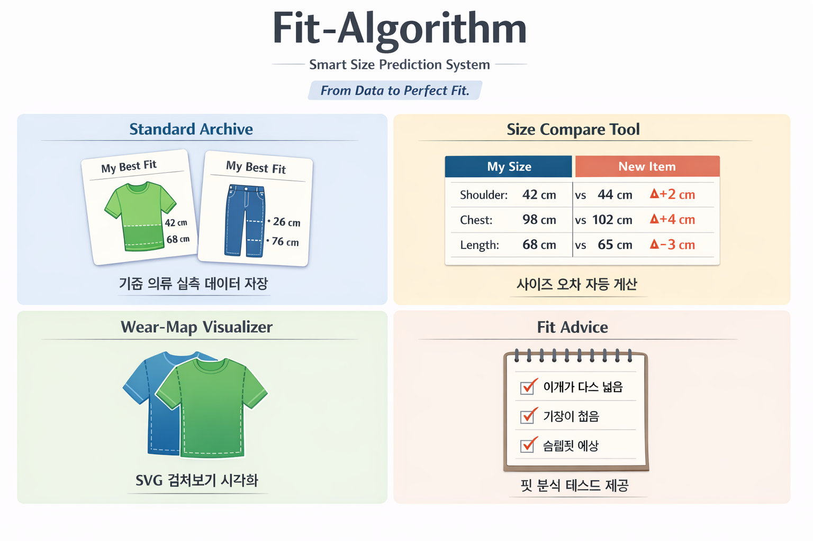

# 🧵 Fit-Algorithm  
### Data-Driven Fit Prediction System

> "핏은 감이 아니라 데이터다."

---

## 📌 1. 프로젝트 개요

| 항목 | 내용 |
|------|------|
| 프로젝트명 | Fit-Algorithm (핏-알고리즘) |
| 프로젝트 유형 | 데이터 기반 패션 분석 웹사이트 |
| 목적 | 의류 실측 데이터를 비교하여 정확한 사이즈 선택 지원 |
| 핵심 가치 | 수치 + 시각화 기반 핏 분석 |
| 대상 사용자 | 온라인 쇼핑에서 사이즈 실패를 줄이고 싶은 사용자 |

---

## 🎯 2. 프로젝트 핵심 컨셉

- 기존: 감으로 사이즈 선택  
- 개선: 데이터 기반 사이즈 비교 및 분석  

✔ 정량적 비교 시스템  
✔ 시각적 피드백 제공  
✔ 개인 체형 데이터 축적  

---

## 🛠️ 3. 기술 스택 (Tech Stack)

| 구분 | 기술 |
|------|------|
| Frontend | HTML5, CSS3, SVG |
| Version Control | Git, GitHub |
| Deployment | GitHub Pages |
| Design Concept | Data-Driven Dashboard |

---

## ⚙️ 4. 핵심 기능

### 4.1 Standard Archive
- 기준 의류 실측 데이터 저장
- 카테고리별 관리 (상의 / 하의)

### 4.2 Size Compare Tool
- 새로운 의류 실측 데이터 입력
- 기준 데이터와 비교하여 차이값(Δ) 계산

### 4.3 Wear-Map (Visualizer)
- SVG 기반 의류 실루엣 생성
- Overlay 방식으로 시각적 비교 제공

### 4.4 Fit Advice
- 오차 데이터를 기반으로 분석 결과 제공

예시:
- 어깨: 넓음  
- 기장: 짧음  
- 전체 핏: 슬림핏 예상  

---

## 🗂️ 5. 디렉토리 구조

```
+-- index.html
+-- comparison.html
+-- guide.html

+-- css/
| +-- reset.css
| +-- style.css
| +-- wear-map.css

+-- assets/
| +-- images/
| +-- svg/

+-- js/

+-- README.md

```
---

## 🖥️ 6. UI / UX 구조

### Header
- 로고 (Fit-Algorithm)
- 메뉴 (Dashboard / Compare / Guide)

### Main

#### Dashboard (index.html)
- 기준 사이즈 카드 형태 요약

#### Compare (comparison.html)
- 좌측: 데이터 입력 폼
- 우측: 비교 테이블 및 Wear-Map

#### Guide (guide.html)
- 의류 측정 방법 안내

### Footer
- 제작자 정보
- GitHub 링크
- 저작권 표시

---

## 🔀 7. 버전 관리 및 협업 규칙

### Branch Strategy (GitHub Flow)

- main: 배포 가능한 상태 유지  
- feature/기능명: 기능 단위 개발  

### Commit Convention

- feat: 기능 추가  
- fix: 버그 수정  
- style: UI 및 스타일 변경  
- docs: 문서 수정  
- refactor: 코드 개선  

---

## 🚀 8. 프로젝트 로드맵

### 1학년 1학기
- HTML/CSS 기반 정적 웹사이트 구현  
- GitHub Pages 배포  

### 1학년 1학기 기말
- JavaScript 추가  
  - 실시간 오차 계산  
  - SVG 동적 제어  

### 1학년 2학기
- React 기반 SPA 전환  

### 2학년
- Spring Boot + MySQL 연동  
- 사용자 데이터 저장  
- 브랜드별 실측 검색 기능  

---

## 💡 9. 기대 효과

- 사이즈 실패 감소  
- 개인 체형 데이터 관리 가능  
- 데이터 기반 패션 추천 확장 가능  

---

## 🔥 10. 차별화 포인트

- 단순 추천이 아닌 데이터 기반 분석 시스템  
- 숫자 + 시각화 결합  
- 개인 데이터 축적 가능 구조  

<br>



## 🧠 한 줄 요약

Fit-Algorithm은 데이터 기반으로 의류 핏을 분석하고 시각화하는 개인 맞춤형 사이즈 예측 시스템이다.